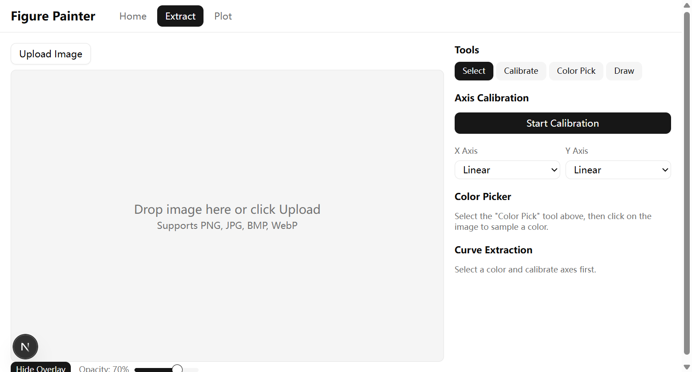
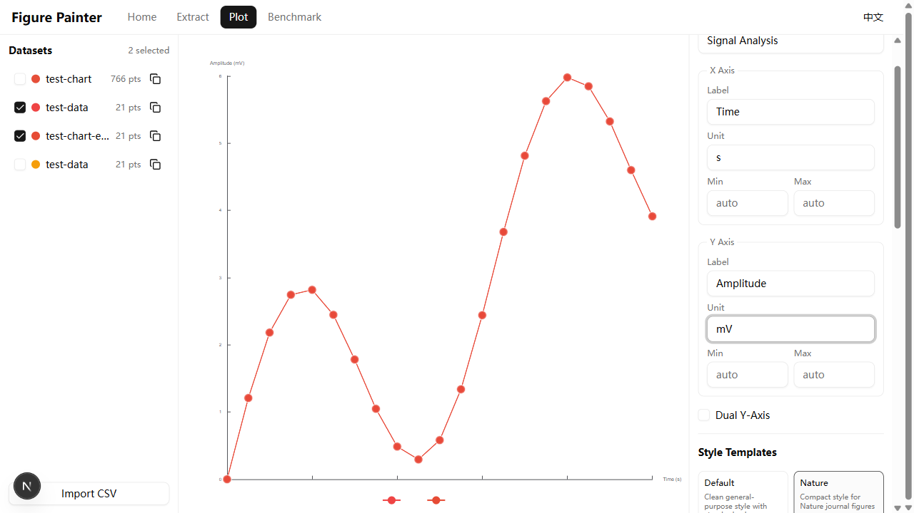
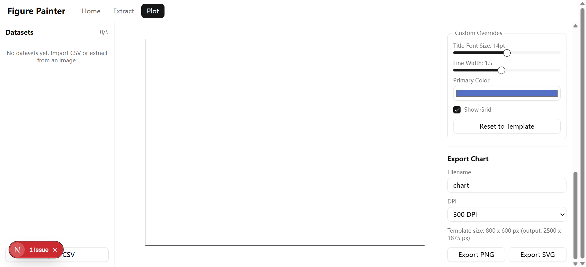

# Figure Painter

基于浏览器的科研论文图表数据提取与绘图工具。

[English](./README.md)

## 截图预览

### 数据提取



### 科研绘图






## 功能特性

### 数据提取
- **图片上传** — 支持上传 PNG、JPG、BMP、WebP 格式的图表图片，可缩放和平移
- **坐标轴标定** — 4 点标定系统，支持线性和对数坐标
- **取色器** — 从图像中采样曲线颜色，可调节容差
- **曲线提取** — 基于颜色匹配自动提取数据点
- **交互式编辑** — 在画布上拖拽数据点，或在数据表中直接编辑数值
- **叠图验证** — 将提取的曲线叠加到原图上进行对比验证
- **数据导出** — 导出为 CSV 或 Excel 格式，或直接发送到绘图模块

### 科研绘图
- **ECharts 引擎** — 交互式图表渲染，实时预览
- **多数据集** — 在同一图表中叠加多组数据，支持双 Y 轴
- **风格模板** — 内置学术期刊绘图风格：
  - **Default** — 通用简洁风格，标准配色
  - **Nature** — 适用于 Nature 期刊的紧凑风格
  - **IEEE** — 适用于 IEEE 出版物的栏宽风格
  - **ACS** — ACS 单栏图表风格
  - **Science** — 适用于 Science 期刊的简约风格
- **自定义覆盖** — 调整标题字号、线宽、配色、网格显示
- **图表导出** — 导出为 PNG 或 SVG，DPI 可配置（72–600）

### 通用特性
- **国际化** — 完整的中英文双语支持
- **纯客户端** — 所有处理均在浏览器端完成，无需服务器
- **本地存储** — 数据集通过 IndexedDB (Dexie) 保存在本地

## 技术栈

| 分类 | 技术 |
|------|------|
| 框架 | [Next.js 16](https://nextjs.org/)（静态导出） |
| UI 组件 | [shadcn/ui](https://ui.shadcn.com/) + [Radix UI](https://www.radix-ui.com/) |
| 样式 | [Tailwind CSS 4](https://tailwindcss.com/) |
| 图表 | [ECharts 6](https://echarts.apache.org/) |
| 状态管理 | [Zustand 5](https://zustand.docs.pmnd.rs/) |
| 本地数据库 | [Dexie 4](https://dexie.org/)（IndexedDB） |
| CSV 解析 | [PapaParse](https://www.papaparse.com/) |
| Excel 导出 | [SheetJS](https://sheetjs.com/) |
| 测试 | [Vitest](https://vitest.dev/) + [Playwright](https://playwright.dev/) |

## 快速开始

### 环境要求

- Node.js 18+
- npm 或 pnpm

### 安装与运行

```bash
# 克隆仓库
git clone https://github.com/your-username/figure-painter.git
cd figure-painter

# 安装依赖
npm install

# 启动开发服务器
npm run dev
```

在浏览器中打开 [http://localhost:3000](http://localhost:3000)。

### 生产构建

```bash
npm run build
```

静态站点将导出到 `out/` 目录，可部署到任意静态托管服务。

## 项目结构

```
figure-painter/
├── app/                    # Next.js 页面（首页、提取、绘图）
├── components/
│   ├── extract/            # 数据提取组件
│   ├── plot/               # 绘图组件
│   ├── shared/             # 导航栏、Provider、语言切换
│   └── ui/                 # shadcn/ui 基础组件
├── lib/
│   ├── i18n/               # 国际化（英文、中文）
│   ├── templates.ts        # 图表风格模板
│   └── types.ts            # TypeScript 类型定义
├── stores/                 # Zustand 状态管理
│   ├── extractStore.ts     # 提取状态
│   ├── datasetStore.ts     # 数据集持久化（Dexie）
│   └── plotStore.ts        # 绘图配置状态
└── services/               # 导出服务（CSV、Excel）
```

## 许可证

MIT
